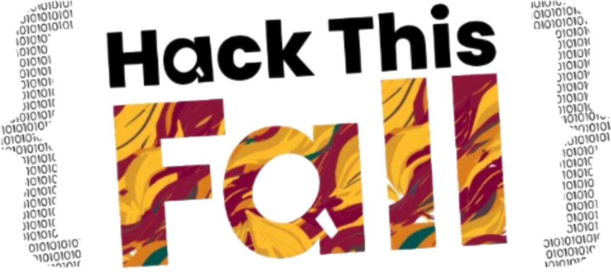

# Hack This Fall - Sri Lanka 🇱🇰

This is the official repository for the Hack This Fall - Sri Lanka 🇱🇰 website.

## Local Development

- Step 1: Copy `development/.vscode` to the root of the project.
- Step 2: Install the dependencies using `npm install`.
- Step 3: Run the development server using `npm start`.

Open [http://localhost:3000](http://localhost:3000) to view it in your browser.

The page will reload when you make changes.\
You may also see any lint errors in the console.

## Useful Links
Bulma Documentation: https://bulma.io/documentation
Figma Design: https://www.figma.com/design/9loo5nnyrLCFXPtiwow7Xe/HTF-design?node-id=63-74&t=LkjZrMtmLdih4JrC-1
